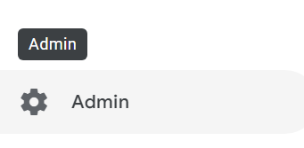
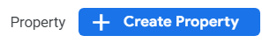

# Google Analytics 4 Tag Manager guide

## Why?
Recently we have had an influx of customers querying our support team about google analytics 4 integrations, or concerns over the July 1, 2023 deprecation of UA Analytics which our guide is based on.

Additionally, Google Analytics 4 wholistically is much easier to implement and should be a better experience for our customers.

## Google Analytics Setup
---
### Create a Property
First step will be to create a new property. This can be done by opening the left-hand nav bar and selecting `admin` at the bottom.

At the top of the page we can find a create property button:

From here you can just name your property and fill out the information required to best suit your needs. There are no settings that need to be specified here.

---
### Creating A Data Stream
After creating a property you should be automatically redirected to the Data Streams page. If not, you can navigate to it from Admin>Data Streams.

Here we will see a few different options optimized for your customer base, but this guide will focus on implementing the `Web` version.

From here, we will be able to set a website and name our datastream, as well as a few options as to what data the datastream will collect - these settings can be left as default.

If you do not have a hosted website you can test on, you can enter a fake website such as the one in the example. This will not impact the datastream's ability to collect data on other websites.

---
### Measurement IDs
Now that you have created your datastream, it may prompt you to install gtag onto your website, however we will come back to this later. For now we can close that prompt and look for our `Measurement ID` which should be in the upper-right corner. We should save this ID for later use, but if needed we can always return to this page in the Admin>Datastreams tab of Google Analytics later.

---
## Google Tag Manager Setup
---
### Create an Account

Now that we have our google analytics property set up we can create our tag manager account. Tag manager will be how we control events and feed data back to google analytics. From the home page we can click the `Create Account` button.

From here we can just follow the prompts and select `Web` as that is what we will be working with.

---
### Install Tag Manager Onto Your Website
After creating your account you should have gotten a pop-up with the installation code required. If you did not get this pop-up you can access these snippets any time by clicking on your Tag Manager ID.

The snippet page should look something like:

From here we can insert the snippets as instructed - the top tag should be as high in the `Head` of your page as possible, and the bottom script should be placed at the top of the `Body` tags.

---
### Creating Your Config Tag
Now that we have our tag manager installed we need to create some tags. We can do this by using the left-hand navbar and navigating to the `Tags` tab. For new accounts it will most likely look like this. We can just click `New`

Now we can click the `Tag Configuration` window and choose `Google Analytics: GA4 Configuration`.

This is where we'll need that Measurement ID from earlier. We can simply add that to the Measurement ID field, give our tag a name, and click `Save`. This tag does not need a `Trigger` as it is just the config tag for our other tags.

---
### Creating Your Event Tag
Something great about tag manager is that while we can have a ton of fine-grain control over our tags and when they fire, we can also create a generic Event tag which will capture and forward all of your events from Tag Manager to Google Analytics.

We can do this by returning to the `Tags` tab from our left-hand navbar and create another new tag.

Instead of the `Configuration` tag we selected before, this time we will select `Google Analytics: GA4 Event`. You will notice the settings look slightly different as we now have a `Configuration Tag` option - we can use this drop-down to set the `Configuration Tag` to the tag we created in the last step.

For the `Event Name` we can click the + icon next to the field and choose `Event`, or simply put `{{Event}}` in the name field. When this tag is triggered it will send all of the events to our google analytics using the set `event_name` property.

Under `More Settings` we also need to enable the ability to send ecommerce data through the data layer. This is how we will pass our purchase information on to google analytics.

---
### Creating Your Event Trigger
Now that we have created the tag that will pass data back to google analytics for us, we need a way to trigger this tag.

Open up the tag configuration for the `Event` tag we just created and click `Choose a trigger to make this tag fire`.

From here click the blue `+` button in the top right. This should open up an options menu where we can scroll down to the `Other` section and choose `Custom Event`.

From here we can tick the `Use regex matching` option, and in the `Event name` field we can enter all of the events we would like to push to google analytics. The event names you insert into this field will pair with the event names you fire in your code. Event names can be separated with the `|` symbol.

In this example, any time we push an event named `purchase` or `checkoutSuccess` to the data layer, we they will trigger our tag and be sent to google analytics.

Once you have added all of your desired events this can be saved and closed. 
You may need to check the `Events` tag created previously to ensure that this trigger appears as a trigger for the desired tag.

---
### Publishing Your Tags
Now that we have configured our tag and trigger we can select `submit` and `publish` in the top-right hand corner. You may fill out the form, but it is not required.

---
## Testing

### Previewing Our Page Events
Once the tag and trigger are set up we can test this by navigating to the Tag Manager `Workspace` page.
In the top-right hand corner there should be a `Preview` button.

From here we can configure the domain we would like to test on - this will be wherever our paddle checkout and google tag manager code lives. This can be tested locally by hosting the page on one of your open ports as shown in the screenshot.

If everything is configured correctly, the website you have hosted should pop up in its own window, and we should see that tag manager has connected to the page.

If we have connected successfully, we can click continue and we should this screen:

- On the left-hand side will be a summary of all events tag manager has detected
- In the center we can see all of our `fired` and `unfired` tags, as well as a tag marked `Data Layer` which will show all of the data that is pushed to the data layer.
- At the top we can see what connections have been made. Currently we are only connected to our tag manager which can be identified by the `GTM` prefix

---
### Testing A Checkout

Once we have connected to our page we can proceed with a checkout. As soon as we see the checkout success page we should be able to see three key details:

- First, our `Paddle Events` tag should now be under the `Tags Fired` section in our tags tab.
- Next, we should see that our google analytics has been identified in the top portion. This can be identified by the `G-` prefix
- Finally, we can see in our `Summary` that the `purchase` event fired.

If we navigate to our analytics tag from the top, we should also see that a `Purchase` hit was triggered and sent to google analytics.

Now if we navigate to the `Data Layer` tab we should also be able to see the ecommerce data we have passed.

A final thing that we can check is the `DebugView` in google analytics. This can be found by navigating to the `Admin` panel, and scrolling to the bottom of the `Property` sub-menu

This debug view is a nearly live feed of all event traffic into your google analytics account. From here we should see that we have made a `purchase` event, which google analytics by default will mark as a conversion. If we click on this event in the timeline we should see some of the ecommerce data we have passed through, such as the `coupon`, `currency`, `transaction_id`, and `value`.

